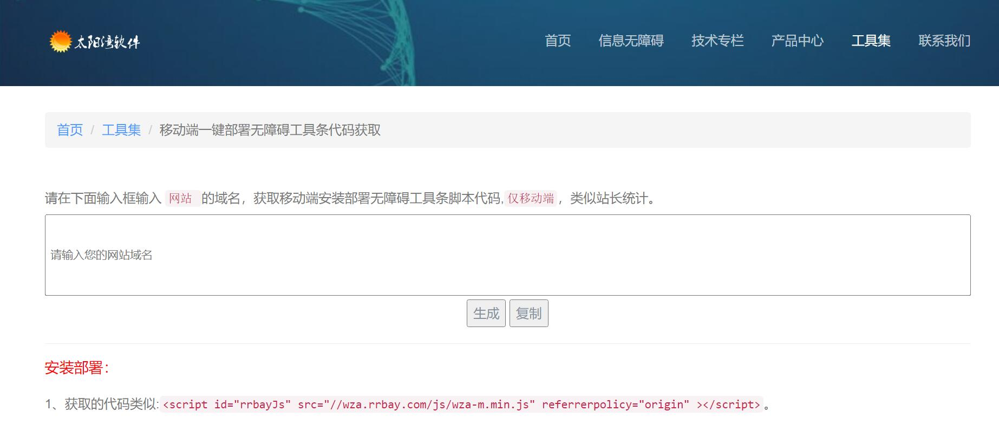

# 网站信息无障碍
[](LICENSE)
[](https://github.com/gemgin/AmblyopiaTool/pulls)
[](https://github.com/gemgin/AmblyopiaTool)
[](https://github.com/gemgin/AmblyopiaTool)

交流QQ群：26363996

## 前言

　　为了体现政府提供公共服务的公平、公正、均等化的要求，保障弱势群体获得政府公众服务的权利，我国政府近年一直致力于推动信息无障碍技术在各个领域的应用，先后制定《无障碍环境建设条例》、《网站设计无障碍技术要求》、《网站设计无障碍评级测试方法》等相关法规及行业标准。在建设服务型政府的大环境之下，信息无障碍服务成为政府主厅提高公众服务水平、扩大公众服务范围的新亮点。

## 项目介绍

　　TTS技术基于ScanSoft_MeiLing语音库，提供整套网站信息无障碍服务模块：十字光标、纯文本、文字放到专用阅读屏（简体，繁体和拼音）、高对比阅读配色器、文字放大缩小、网页放大缩小、全程语音实时朗读等，支持服务治理、监控和追踪，努力为政府网站无障碍改造解决方案。

### 第二种部署方式

- 访问```http://www.qqqao.com/index6.html```

- 输入需要信息无障碍工具条的网站域名，获取代码。例如下面代码：
  
  ```<script src="http://wza.rrbay.com/api.aspx?id=5c78fc8690f01a05583f8546" type="text/javascript"></script>```

- 请将获取的代码添加到该域名网站全部页面的</head>标签前。 

- 建议在header.htm类似的页头模板页面中安装，以达到一处安装，全站皆有的效果。

> 测试部署是否成功

   在浏览器中输入地址或通过单击原网站右下角无障碍操作条中的链接即可完成对网站的信息无障碍化访问。

> 申明:太阳湾信息无障碍公共服务平台工具条免费安装部署，要严格按照上面步骤部署安装修改,请保留太阳湾版权信息。

### 获取代码界面


### 信息无障碍工具条效果图


### 演示站点

- 工具条演示 [http://www.qqqao.com/index5.html](http://www.qqqao.com/index5.html "一行代码部署无障碍工具条")

### License

GNU AFFERO GENERAL PUBLIC LICENSE Version 3, 19 November 2007
